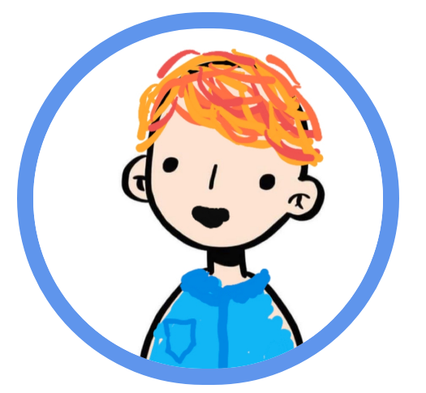
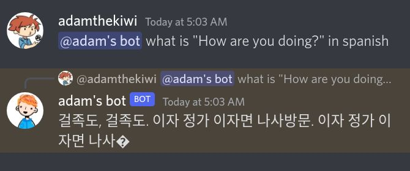
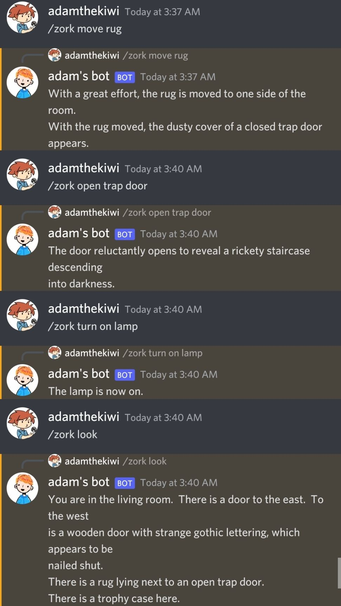
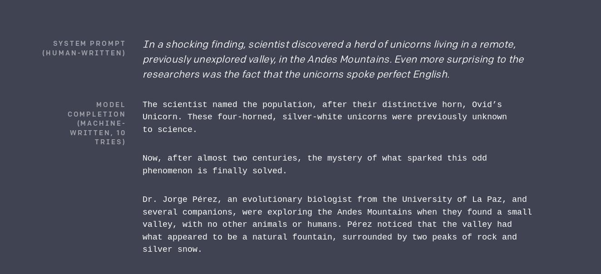

# adam's bot

A mini me for my Discord server!

<div align="center">
    
</div>

## What does adam's bot do?

I made this bot to serve two functions:

1. To be a goofy, unpredictable, and somewhat intelligent chat bot. It's very dumb, but in a way that's entertaining.
2. To be a dungeon master for an adventure game.


<p class="column" float="left">
    
    
    
</p>

## How does it work?

The chatbot function is powered by [GPT-2](https://openai.com/blog/better-language-models/), using the [aitextgen](https://docs.aitextgen.io/) library. It turns the user input into a prompt for GPT-2 using the Q&A format (`Q: {user-input} A: `). Then, the prompt is fed into GPT-2 to complete, and the result is trimmed to be sent back in the Discord chat.



The "dungeon master" function is more tricky. It works by using a modified version of [devshane's zork repository](https://github.com/devshane/zork/search?q=rdline_) (a C port of the original game). The only change I made was to make the program consistently output `>` when prompting user input. (For some reason, it only seems to output `>` when using a non-piped STDIN). I did this just by adding `puts(">");` to the beginning of the `void rdline_(char*, int);` function.

The "dungeon master" feature can handle multiple dungeons at a time (one dungeon per user at a time), and can be used in direct messages and servers both.

## How do I use it?

To use the GPT-2 chat bot, simply mention the bot by typing `@` along with the bot's name, and then include whatever you'd like the bot to respond to!


Users can start a dungeon game by using the `/zork` command, and can send successive commands using phrases like `/zork go west`. To quit a session, send `/zork quit`. All commands only affect the sender's dungeon.

## How do I run it?

***You will need `make`, `python3`, `pip`, and a C compiler.***
*Also, follow [this guide](https://discordpy.readthedocs.io/en/stable/discord.html) to create your bot in the discord developer portal before starting.*

First, download the repository using `git`.

```bash
git clone https://github.com/adam-mcdaniel/adams-bot
cd adams-bot
```

Then, run the Makefile to build the Zork source and install the required pip packages.

```bash
make build
```

Finally, run `python3 main.py`! This will ask you for your bot's token. Just copy and paste it into the prompt, and that's it!